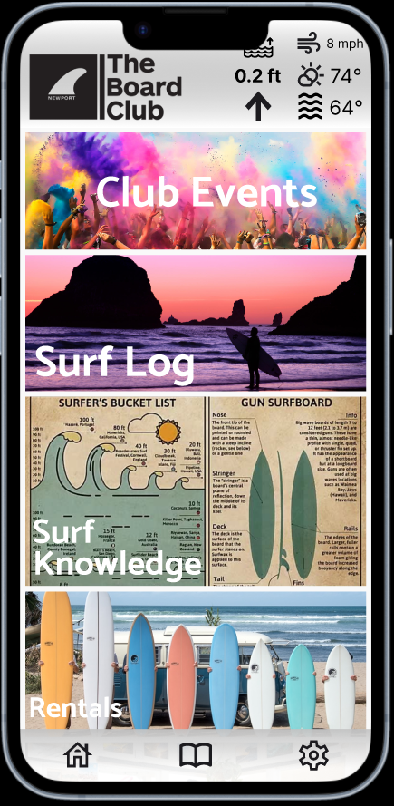
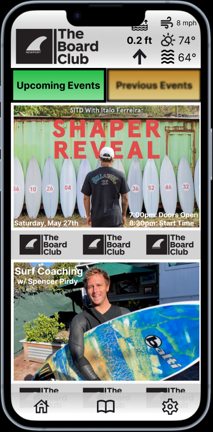
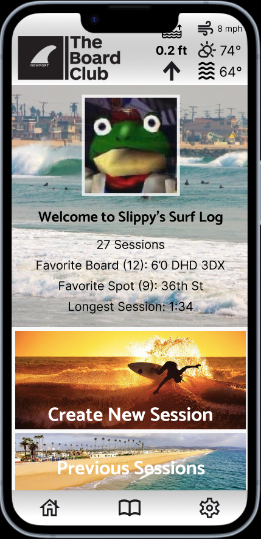
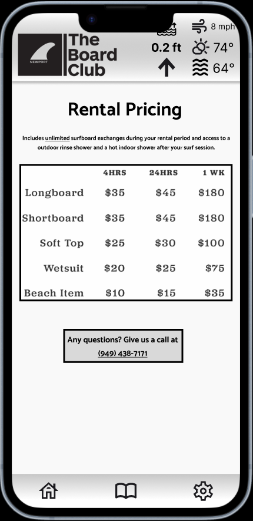
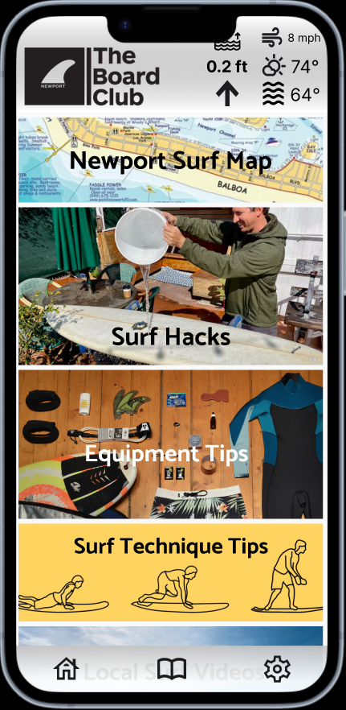
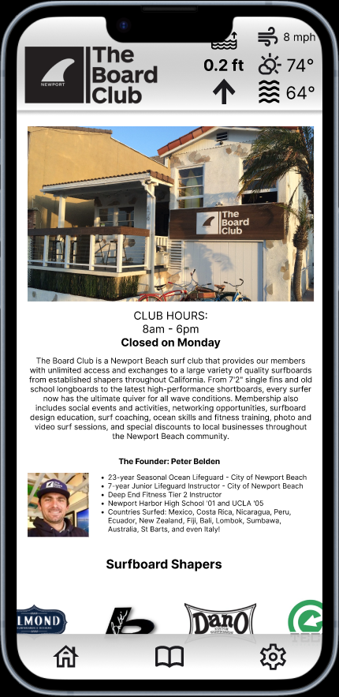
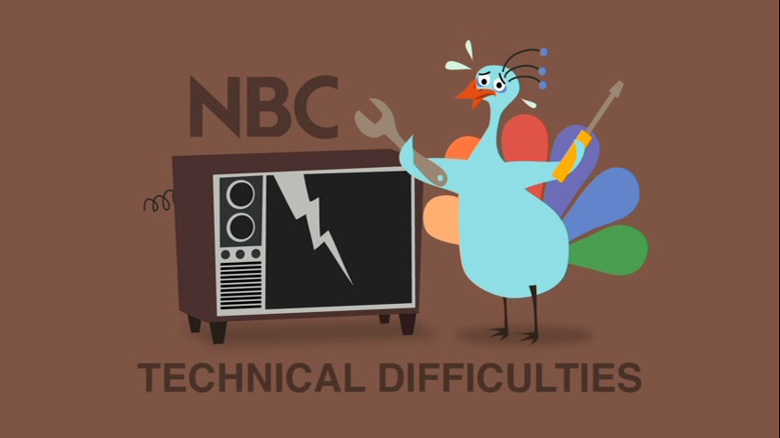

<div align="center">
<h1>The Board Club App</h1>
 <p align="center">
  
<h4>React Native application designed to offer the Newport Board Club app on both the Apple and Android platforms via their respective stores.</h4>
</div>

<br>
<br>

## Table-of-Contents

* [Deployment](#deployment)
* [Goal](#description)
* [Features](#features)
* [Installation](#installation)
* [Wireframe](#wireframe)
* [Technology](#technology)
* [Demo](#demo)


<br>

## [Goals](#table-of-contents)

The goal of this application to make members want to go surf by providing them with the all the infomation they need to have a great surf session. The app easily shows the current surf and weather conditons. Events are displayed to make it easy for memebers to get information they need to attend upcoming events. The Surf Log allow memebers to keep a log of all their surf sessions to track their progression and review previous sessions when selecting a surf spot or board for their next session. Surf hacks are listed to help new members with common surf problems. The Newport Surf map helps members easily pick the best spot to go surfing while visiting the club house based on  a variety of factors and conditions. The comminity forum helps memebers find other memebrs to surf with and also to interact memebers to build a sense of community.

<br>
<br>

## [Features](#table-of-contents)

<br>

* ~~Surfboard Database :surfer:~~
  * ~~Description~~
  * ~~Specs~~
  * ~~MFG Link~~
  * ~~Photos~~
  * ~~Comments/Feedback~~
  * ~~Rating~~

<br>

* Rental Infromation 🧾
  * Equipment
  * Prices / Hours

<br>

* Events Page :confetti_ball:
  * Upcoming Events
  * Previous Events
  * Calender View

<br>

* About :question:
  * General Club Info
  * ~~Shaper Info/Links/Deals~~
  * ~~Club Press~~

<br>

* Surf Diary :open_book:
  * Log Each Surf Session
  * Review previous surf Sessions
  * Track surf progression

<br>

* Live WX :partly_sunny:
  * Water Temp
  * Tempeture
  * Wind
  * Sky Conditions
  * Popup/Overlay Widget

<br>

* Surf Resources :open_book:
  * ~~Beginner Videos~~
  * ~~Equipment Tips~~
  * Surf Hacks
  * Local Surf Spots Beta
  * Newport Surf Map


<br>

* Push Notification :loudspeaker:
  * Surfboard Overdue
  * New Surfboards
  * Upcoming Events
  * Swell / Conditions

<br>

* Features Pushed to React Native Version :iphone:
  * Push Notification
  * Member Forum
 
<br>
<br>

## [Installation](#table-of-contents)

* Server/API

```
    1) npm run buildServer
    2) npm run startServer
```
<br>

* Client
  ```
  1) npm run buildClient
  2) npm run startClientServe
  ```
<br>
<br>

## [Wireframe](#table-of-contents)

 <p align="center">
  
  <p align="center"><strong>Home Page</strong></p>
</p>

<br>
<br>

 <p align="center">
  
  <p align="center"><strong>Club Events</strong></p>
</p>

<br>
<br>

 <p align="center">
  
  <p align="center"><strong>Surf Log</strong></p>
</p>

<br>
<br>

 <p align="center">
  
  <p align="center"><strong>Rental Page</strong></p>
</p>

<br>
<br>

 <p align="center">
  
  <p align="center"><strong>Surf Knowledge</strong></p>
</p>

<br>
<br>

 <p align="center">
  
  <p align="center"><strong>About Page</strong></p>
</p>

<br>
<br>

## [Technology](#table-of-contents)

* <h3> Software Stack </h3>

<br>

  * **Android Client** ()
    * Packages
      * 
      * 
      * 
      * 


<br>

  * **iOS Client** ()
    * Packages
      * 
      * 
      * 
      * 
      * 


<br>

* <h3> Hardware/Deploy </h3>

  * Railway (Database)
    * MongoDB
  * Railway (Host)
    * Client: 
    * API: https://boardclubapp-production-api.up.railway.app/
  * GitHub (Verison Control)
    * 
  * AWS (S3)
    * US West 1

<br>
<br>

## [Demo](#table-of-contents)

 <p align="center">
  
</p>

<br>
<br>
